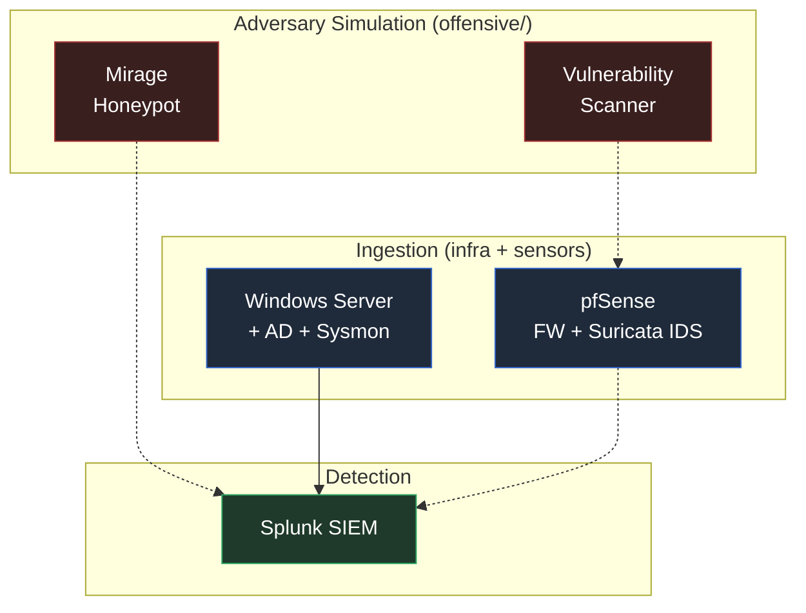

# Defensive Lab Architecture

> How the projects in this homelab compose into a single attack-generation and
> detection pipeline: offensive tooling produces realistic telemetry, the
> ingestion layer captures it, and Splunk turns it into detections.

This is a conceptual map. Some edges are **implemented** (code/config exists and
is documented), others are **illustrative** (the interfaces exist on both sides
but the forwarding glue isn't wired yet). Each edge is tagged in the
[Data Flow Table](#data-flow-table) below.

For the physical VM/network layout (pfSense, Kali, Windows AD + Splunk,
Metasploitable, Ubuntu Blue Team), see
[`diagrams/lab-network.mmd`](diagrams/lab-network.mmd).

---

## Layered Architecture

---

## How to read the diagram

- **Layers stack top-to-bottom.** Simulated adversary activity enters at the
  top, perimeter and endpoint sensors capture it in the middle, and Splunk
  produces detections at the bottom.
- **Solid arrows (`-->`)** mark flows implemented today — a log source that is
  actually forwarded into Splunk and searchable.
- **Dashed arrows (`-.->`)** mark illustrative flows — the sensor and Splunk
  both exist, but the forwarding glue isn't wired yet.

---

## Data Flow Table

| # | Source | → Destination | Payload | Status |
|---|---|---|---|---|
| 1 | [Windows Server + AD](../projects/defensive/windows_server_with_AD/) | [Splunk](../projects/defensive/splunk/) | Sysmon + Windows Security event logs via Universal Forwarder | implemented |
| 2 | [pfSense](../projects/defensive/pfsense_firewall/) | [Splunk](../projects/defensive/splunk/) | Firewall + Suricata IDS alerts | illustrative |
| 3 | [Mirage](../projects/offensive/honeypot/) | [Splunk](../projects/defensive/splunk/) | Honeypot session events (SSH/HTTP/FTP/Telnet) | illustrative |
| 4 | [Vulnerability Scanner](../projects/offensive/vulnerability_scanner/) | [pfSense](../projects/defensive/pfsense_firewall/) / Suricata | Port-scan and probe traffic the IDS should flag | illustrative |

---

## Layer-by-layer summary

**Adversary Simulation** — Mirage and the vulnerability scanner double as test
harnesses for the blue-team stack. Running a vulnerability scan, or leaving
Mirage exposed, generates realistic recon and intrusion telemetry for the
sensors to pick up.

**Ingestion** — where raw signal enters. pfSense with Suricata sits at the
perimeter; Windows Server + AD with Sysmon and the Splunk Universal Forwarder
covers the endpoint and identity side.

**Detection** — Splunk runs detection content against the forwarded Sysmon and
Windows Security logs, with the perimeter (pfSense/Suricata) and honeypot
(Mirage) sources as further inputs.

---

## Related documents

- [Main README](../README.md) — per-project index with tech stacks
- [`docs/diagrams/lab-network.mmd`](diagrams/lab-network.mmd) — physical VM /
  network topology
