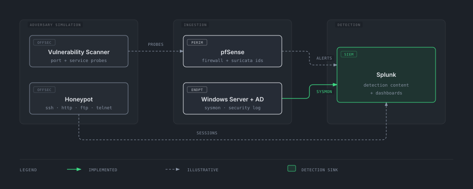

# Defensive Lab Architecture

> How the projects in this homelab compose into a single attack-generation and
> detection pipeline: offensive tooling produces realistic telemetry, the
> ingestion layer captures it, and Splunk turns it into detections.

This is a conceptual map. Some edges are **implemented** (code/config exists and
is documented), others are **illustrative** (the interfaces exist on both sides
but the forwarding glue isn't wired yet). Each edge is tagged in the
[Data Flow Table](#data-flow-table) below.

For the physical VM/network layout (pfSense, Kali, Windows AD + Splunk,
Metasploitable, Ubuntu Blue Team), see
[`pfsense_firewall/docs/topology.md`](../projects/defensive/pfsense_firewall/docs/topology.md).

---

## Layered Architecture

Source: [`diagrams/defensive-architecture.html`](diagrams/defensive-architecture.html)

---

## How to read the diagram

- **Layers run left to right.** Simulated adversary activity enters on the
  left, perimeter and endpoint sensors capture it in the middle, and Splunk
  produces detections on the right.
- **The solid green arrow** marks the one flow implemented today — the Windows
  Security event log, which is actually forwarded into Splunk and searchable.
- **Dashed grey arrows** mark illustrative flows — the sensor and Splunk both
  exist, but the forwarding glue isn't wired yet.

---

## Data Flow Table

| # | Source | → Destination | Payload | Status |
|---|---|---|---|---|
| 1 | [Windows Server + AD](../projects/defensive/windows_server_with_AD/) | [Splunk](../projects/defensive/splunk/) | Windows Security event logs via Universal Forwarder | implemented |
| 2 | [pfSense](../projects/defensive/pfsense_firewall/) | [Splunk](../projects/defensive/splunk/) | Firewall + Suricata IDS alerts | illustrative |
| 3 | [Honeypot](../projects/offensive/honeypot/) | [Splunk](../projects/defensive/splunk/) | Honeypot session events (SSH/HTTP/FTP/Telnet) | illustrative |
| 4 | [Vulnerability Scanner](../projects/offensive/network-vulnerability-scanner/) | [pfSense](../projects/defensive/pfsense_firewall/) / Suricata | Port-scan and probe traffic the IDS should flag | illustrative |
| 5 | [Windows Server + AD](../projects/defensive/windows_server_with_AD/) | [Splunk](../projects/defensive/splunk/) | Sysmon process/network telemetry | illustrative |

---

## Layer-by-layer summary

**Adversary Simulation** — the honeypot and the vulnerability scanner double as
test harnesses for the blue-team stack. Running a vulnerability scan, or leaving
the honeypot exposed, generates realistic recon and intrusion telemetry for the
sensors to pick up.

**Ingestion** — where raw signal enters. pfSense with Suricata sits at the
perimeter. On the endpoint and identity side, the Splunk Universal Forwarder on Windows Server + AD forwards Windows Security event logs today.
Sysmon is not yet deployed.

**Detection** — Splunk runs detection content against the forwarded Windows
Security logs (see [`projects/defensive/splunk/detections/`](../projects/defensive/splunk/detections/)), with the perimeter (pfSense/Suricata) and
honeypot sources as further inputs.

---

## Related documents

- [Main README](../README.md) — per-project index with tech stacks
- [`pfsense_firewall/docs/topology.md`](../projects/defensive/pfsense_firewall/docs/topology.md) — physical
  VM / network topology
