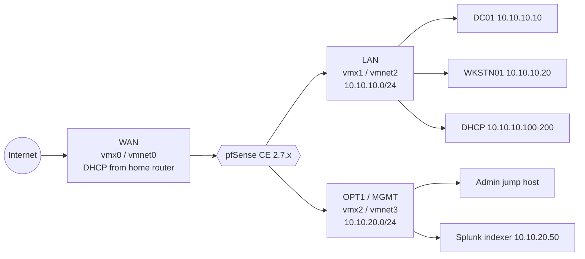

# pfSense Network Topology

## Segmentation rules (summary)

| From → To    | Default action | Notes                                                         |
|--------------|---------------|---------------------------------------------------------------|
| LAN  → WAN   | pass          | Default outbound                                              |
| LAN  → DC01  | pass (AD ports) | Kerberos, LDAP, SMB, GC — explicit allow                    |
| LAN  → MGMT  | **block**     | Users can't reach the admin network directly                 |
| MGMT → LAN   | pass          | Admin jump path                                               |
| MGMT → WAN   | pass          | Updates, threat-intel feeds                                   |
| WAN  → LAN   | block         | Default (no inbound NAT)                                     |
| WAN  → any RFC1918 source | block | Defence-in-depth with `blockpriv` on the WAN interface |

## Why two segments

Keeps detection/observability infra (SIEM, logs collector, admin browser) off the same broadcast
domain as the attack targets. Makes detection-engineering exercises realistic:
- Beacons from WKSTN01 have to egress *through* the firewall to reach C2, so they show up in Suricata + pfBlockerNG logs.
- An attacker who compromises WKSTN01 can't pivot to the Splunk indexer without punching through the LAN→MGMT block rule.
