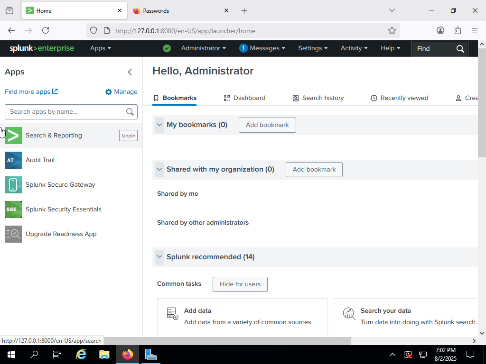
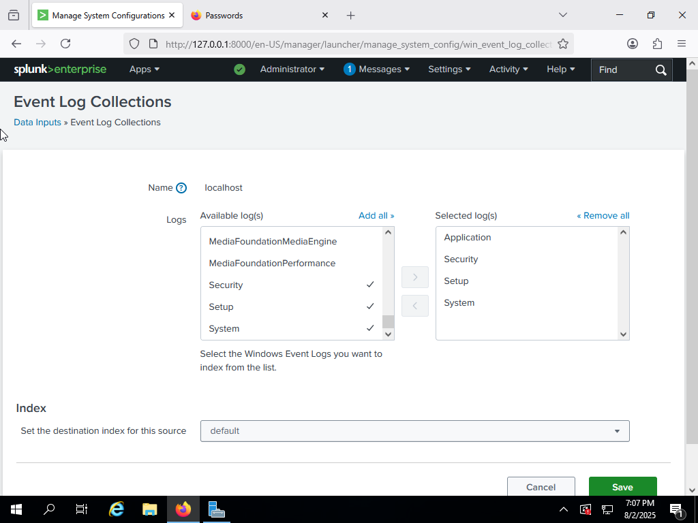
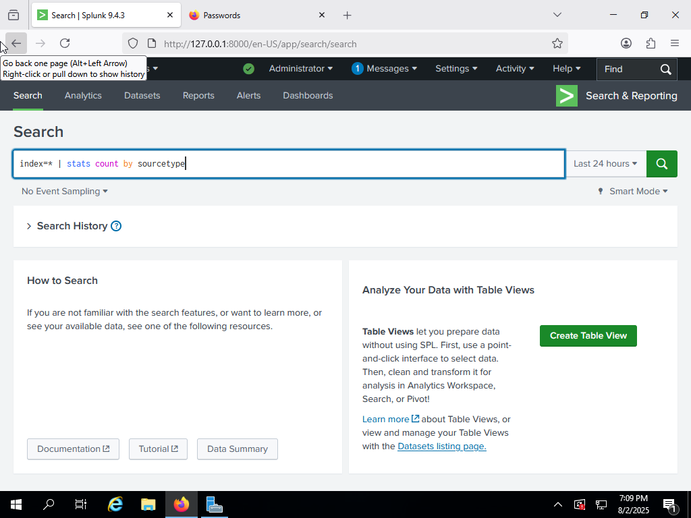
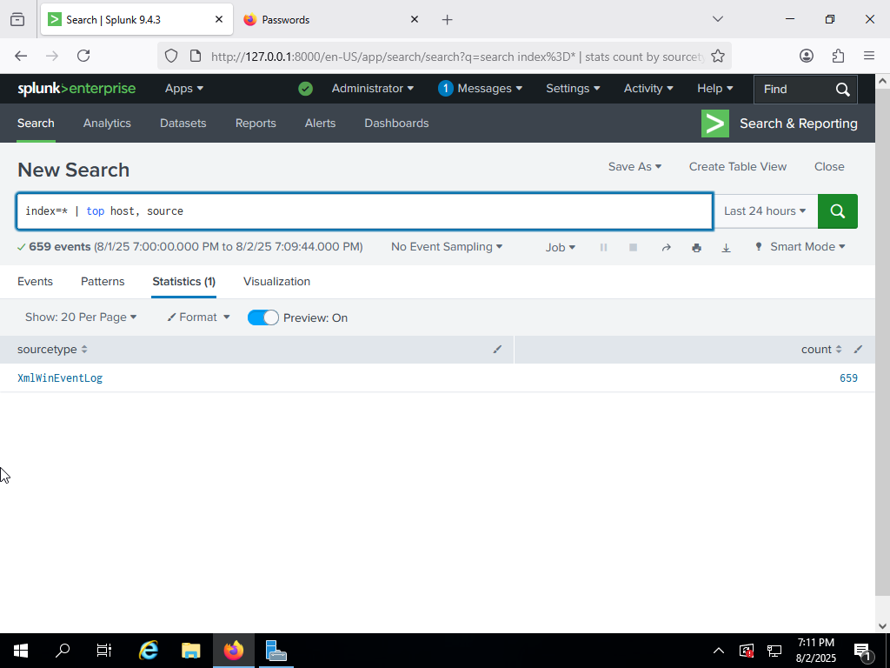
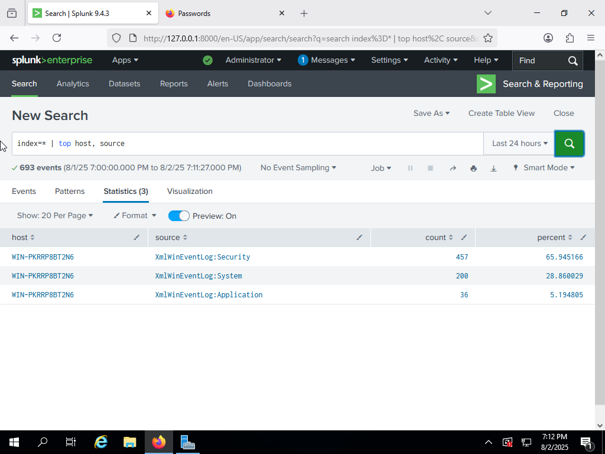
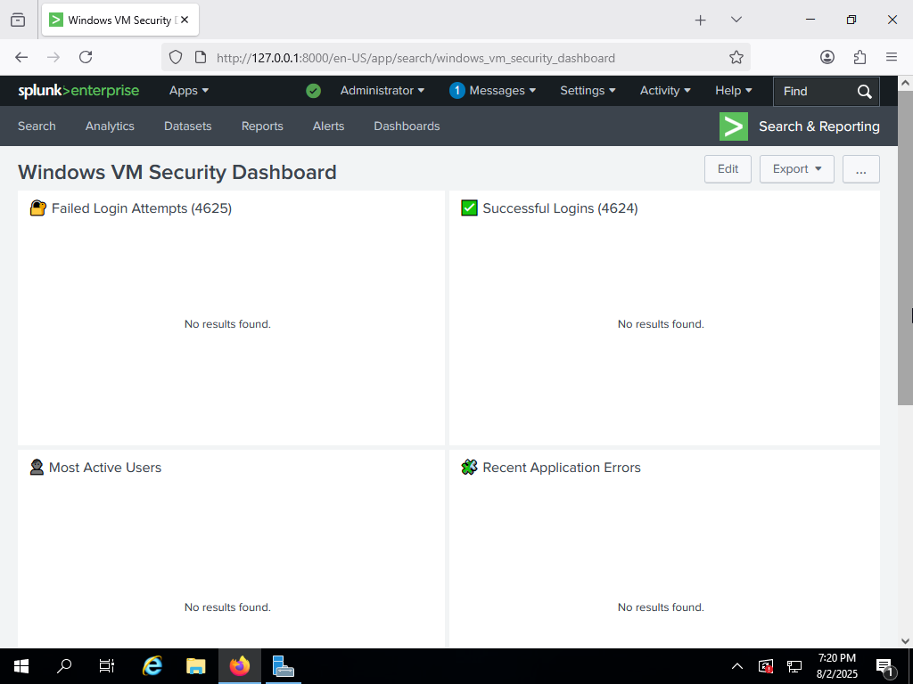

# Splunk Enterprise — Windows Homelab Deployment

> Centralised logging and detection engineering for the cybersecurity homelab:
> onboarding Windows telemetry into Splunk, verifying ingestion, and building
> detections against simulated attacks.

---

## 1. Lab Topology

| Host | Role | OS |
|------|------|----|
| `WIN-SPLUNK` | Splunk Enterprise 9.x | Windows Server 2022 |
| `WIN-DC01`   | AD DS / DNS / DHCP    | Windows Server 2022 |
| `WIN-WS01`   | Workstation + Sysmon  | Windows 10 Pro |
| `pfSense`    | Perimeter firewall    | pfSense CE 2.7 |



---

## 2. Apps / Add-ons Installed

| App | Purpose |
|-----|---------|
| **Splunk App for Windows Infrastructure** | Dashboards for AD, DNS, DHCP, etc. |
| **Splunk Security Essentials (SSE)** | 120+ ATT&CK-mapped detections |
| **Splunk Common Information Model (CIM) Add-on** | Data-model normalisation |
| **Splunk App for Sysmon** | Visualises Sysmon Event ID 1–24 |

---

## 3. Data Onboarding

### 3.1 Universal Forwarder (UF)

Installed on each Windows host, forwarding to the indexer on port 9997:

```powershell
msiexec /i splunkforwarder-9.x.x-x64-release.msi AGREETOLICENSE=Yes ^
  RECEIVING_INDEXER="WIN-SPLUNK:9997" WINEVENTLOG_SEC_ENABLE=1 ^
  WINEVENTLOG_SYS_ENABLE=1
```

### 3.2 Event Log Collection

Enabled Windows logs: **Application**, **Security**, **Setup**, **System**.



---

## 4. Verification & Search

### 4.1 Ingestion Check

```spl
index=* | stats count by sourcetype
```

Confirmed the `XmlWinEventLog` sourcetype with 659+ events.



```spl
index=* | top host, source
```



### 4.2 Error Check

```spl
index=* sourcetype="XmlWinEventLog:Application" Type="Error"
```

Result: 0 application-level errors found.



---

## 5. Dashboard: Windows VM Security

A dashboard for real-time visibility into:

- Failed login attempts
- Successful logins
- Most active users
- Recent application errors



> Some panels showed no results at time of capture — pending more live data.

---

## 6. Detection Walkthrough: SMB Brute-Force

An end-to-end attack → detection exercise: brute-forcing SMB logins from Kali
against a Windows host, confirming Windows logs the failures (EventCode 4625),
the Universal Forwarder ships them, and a Splunk alert fires on the pattern.

```spl
index=wineventlog EventCode=4625
| stats count by Account_Name, src_ip
| where count > 5
```

Full walkthrough with screenshots: [brute-force-detection-simulation/notes.md](brute-force-detection-simulation/notes.md).

---

## Summary

- Windows telemetry from multiple hosts onboarded and verified in Splunk
- Dashboards and searches confirm visibility of Windows Event Logs
- CIM, Sysmon, and detection add-ons integrated
- Simulated SMB brute-force detected end-to-end via EventCode 4625

Screenshots for each step are in [`screenshots/`](screenshots/).
