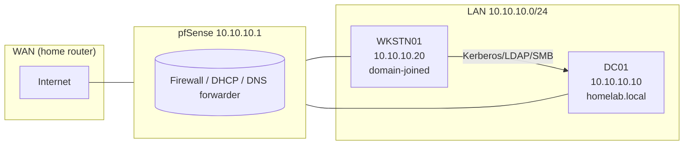

# Topology

## Host roles

| Host    | IP          | Role                    | OS                   |
|---------|-------------|-------------------------|----------------------|
| DC01    | 10.10.10.10 | Domain Controller       | Windows Server 2022  |
| WKSTN01 | 10.10.10.20 | Domain-joined client    | Windows 10/11        |
| pfSense | 10.10.10.1  | Gateway / DHCP / DNS    | pfSense CE 2.7.x     |

## Why 10.10.10.0/24

Matches the subnet defined in `projects/defensive/pfsense_firewall/` so the two labs
run side-by-side on a single VMware host-only network (`vmnet2`).
